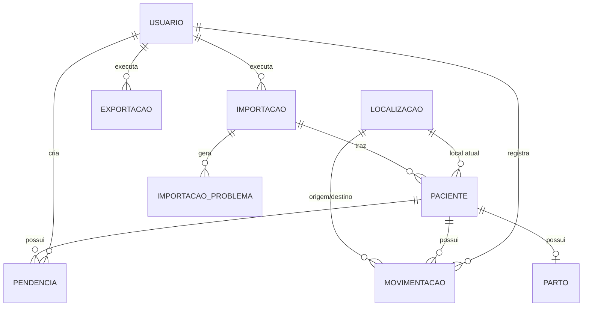

```mermaid
erDiagram
  USUARIO ||--o{ MOVIMENTACAO : registra
  USUARIO ||--o{ PENDENCIA : cria
  USUARIO ||--o{ IMPORTACAO : executa
  USUARIO ||--o{ EXPORTACAO : executa
  PACIENTE ||--o{ MOVIMENTACAO : possui
  PACIENTE ||--o{ PENDENCIA : possui
  PACIENTE ||--o| PARTO : possui
  LOCALIZACAO ||--o{ PACIENTE : "local atual"
  LOCALIZACAO ||--o{ MOVIMENTACAO : "origem/destino"
  IMPORTACAO ||--o{ PACIENTE : traz
  IMPORTACAO ||--o{ IMPORTACAO_PROBLEMA : gera
```